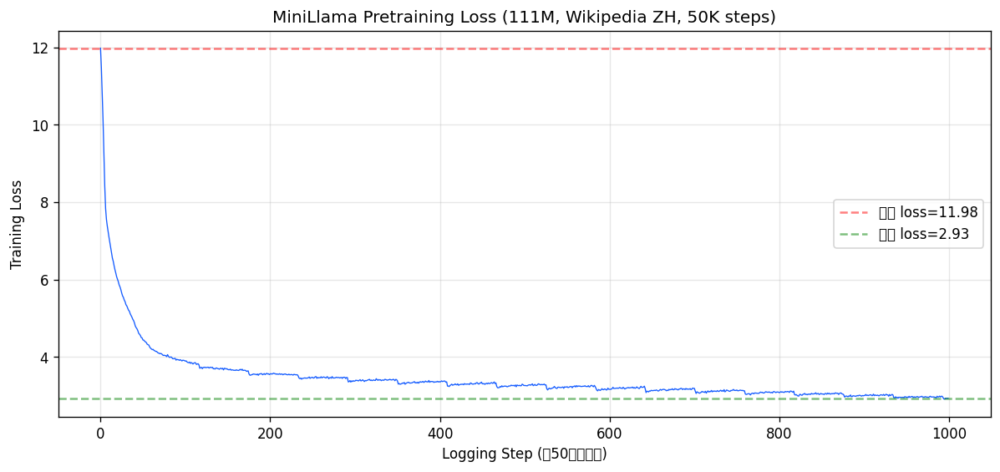

# 实验记录 · MiniLlama-Pretrain

## 基本信息
- **实验日期**:2026-07-07 ~ 2026-07-08
- **模型**:MiniLlama(缩小版 Llama 架构,111M 参数)
- **架构**:6 层 × 576 维 × 9 头,LlamaForCausalLM
- **数据**:Wikipedia 中文子集,50000 篇文章,9570 万 tokens,186989 个 512-token 块
- **训练步数**:50000 步
- **GPU**:NVIDIA L40(46GB),l40gpu001
- **训练时长**:10 小时 32 分

## 核心结果:随机初始 vs 预训练后

| 指标 | 随机初始 | 预训练后 | 变化 |
|------|---------|---------|------|
| Loss | 12.04 | **2.93** | ↓ 9.11 |
| 困惑度 Perplexity | 168965 | **31.34** | ↓ 168934 |

## 训练曲线

观察:
- Loss 从初始 11.98 平稳下降,前 5000 步快速降到 ~5,之后缓慢收敛
- 最终 loss 稳定在 2.9 左右,最低 2.91
- 困惑度从 168965(完全乱码)降到 31.34(能生成连贯中文)

## 生成对比(case study)

### 随机初始(训前)—— 纯乱码
模型输出无意义的 token 序列。

### 预训练后(训后)—— 连贯中文

| Prompt | 生成 |
|--------|------|
| 人工智能的未来 | 性,其可能来自人类对语言的感知……20世纪50年代,麻省理工学院…… |
| 深度学习是一种 | 非常重要的方式。在2008年,他发表了一篇题为…… |
| 计算机科学 | 领域,它培养了众多生物学家和生物化学家…… |
| Python 是 | 一个可实现的自由开源的Python,它在Python中被广泛地使用…… |

> 注:111M 参数的小模型能生成语法正确、主题相关的连贯中文,但事实准确性有限(会出现虚构的年份/人名)。这符合小模型预训练的预期 —— 学会了"语言能力",但"世界知识"不足。

## 关键结论(面试话术要点)

1. **从零预训练**:从随机权重训了 111M 参数的 Llama 架构模型,完成了真正的预训练流程(不是微调)。
2. **数据与目标**:用 Wikipedia 5 万篇中文无标注文本做因果语言建模(CLM),loss 从 11.98 降到 2.93,困惑度从 168965 降到 31.34。
3. **架构可迁移**:用的是标准 LlamaForCausalLM,只是缩小到 111M,架构与 Llama/Qwen 一致,经验可直接迁移到大模型。
4. **工程能力**:完整覆盖「数据 tokenize+打包 → 随机初始化 → CLM 训练 → 困惑度评测 → 生成对比」全链路,在南科大集群 L40 上跑了 10.5 小时完成。
